```mermaid
    timeline
        title 🕒 Experience Timeline
        2018 : Software Engineer (Web Development)
        2022 : Embedded Engineer — Lenewt (Engineering Office), Lyon
        2023 : Embedded Engineer — Volvo Group
        2024 : Embedded Engineer — ACTIA
        2025 : International Experience (1 year abroad)
```

# 👋 Hi, I'm Rémi Boivin

**Embedded Engineer (Mid-level)**  
C / C++ • Embedded Systems • Robotics • Automotive • Open Source  

🚗 Automotive-inspired embedded systems for robotics  
🎨 Writing clean, reliable, and innovative embedded software

---

## 🎯 Professional Summary

Embedded engineer with a solid background in **embedded C/C++ development** and prior experience in **web software engineering**.  
This dual background allows me to bring **strong software engineering practices** into **low-level and embedded environments**.

Experienced in **automotive and industrial embedded systems**, with a strong interest in **robust architectures, system reliability, and open-source development**.

💼 **Actively seeking an Embedded Engineer position**  
🌍 Open to **on-site or remote opportunities**

---

## 🧠 Core Skills

### 💻 Programming Languages
- C
- C++
- Python
- Rust (learning)

### ⚙️ Tools & Technologies
- Git
- Docker, Docker Compose, Docker Swarm
- Embedded Linux
- CI-friendly workflows
- Debugging & performance analysis

### 🧩 Embedded Expertise
- Embedded software architecture
- Hardware / software integration
- Automotive-oriented development
- System reliability and maintainability

---

## 🚀 Key Projects

### 🤖 Automotive-Inspired ECU for Robotics
**Technologies:** C, C++, Embedded Systems  
- Designed an **ECU-like embedded architecture** inspired by automotive systems
- Focus on **modularity, robustness, and scalability**
- Applied **hardware/software co-design** principles for robotics use cases

### 🦀 Rust for Embedded Systems
**Technologies:** Rust, Embedded  
- Learning and experimenting with **Rust memory safety** in embedded contexts
- Evaluating **Rust vs C/C++** for system reliability
- Building experimental embedded projects

### 🧱 Embedded Systems & 3D Prototyping
**Technologies:** Embedded systems, 3D design  
- Integrating embedded software with **3D-designed hardware**
- Prototyping complete hardware/software systems
- Improving system-level design skills

---

---

## 📌 Career Goals

- 💼 **Embedded Engineer position**
- 🚗 Automotive, robotics, or aerospatial embedded systems
- 🌱 Continuous learning (Rust, embedded architectures)
- 🤝 Active participation in **open-source embedded projects**

---

## 📊 GitHub Activity

## 📊 GitHub Activity

  
  

  
  

---

<!--START_SECTION:waka-->
<!--END_SECTION:waka-->

## 📄 Recruiters & ATS

An ATS-friendly version of my profile is available here:  
➡️ [README_ATS.md](./README_ATS.md)  
➡️ Raw text: https://raw.githubusercontent.com/remiboivin021/remiboivin021/refs/heads/main/README_ATS.md

## 🔗 Contact

---

> ⚡ *“Great embedded systems are invisible — reliable, efficient, and precise.”*
